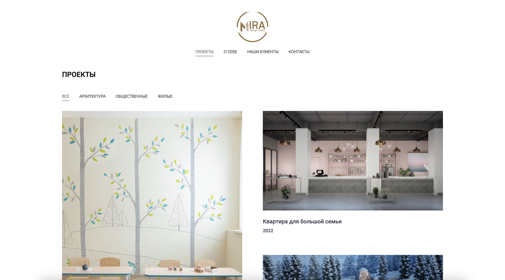

# dsmira.com

This is a portfolio site created with nextJS and python backend.




1. To view a site **[click here](https://dsmira.com/)**.
2. To view a site's code **[visit repository](https://github.com/Starck43/dsmira.com.git)**.
3. To manage content **[open Django](https://admin.dsmira.com)**.


## Backend

Based on Django with Rest framework.
 - `backend` -  Django project
 - `backend/api` -  API app

 For creating API used `djangorestframework` package
 All project packages saved in `backend/requirements.txt` file

```bash
# Environment installation
$ python3 -m venv venv
# Install main project crm
$ django-admin startproject crm .
# or create new SECRET KEY
$ python -c 'from django.core.management.utils import get_random_secret_key; print(get_random_secret_key())'
# Install api app
$ django-admin startapp api
# Activate Virtual Environment
$ source ./venv/bin/activate
$ python3 manage.py createsuperuser
# Install all dependence packages
$ pip install -r requirements.txt
$ python manage.py migrate
$ python manage.py makemigrations
# collect static
$ python manage.py collectstatic
# run server
$ python manage.py runserver [localhost:8000]
````

### API endpoints
   - `pages/` - get all pages list
   - `pages/<str:slug>/` - get page by name (i.e. homepage, projects)
   - `pages/<str:slug>/<int:pk>/` - get page by name and id (i.e. projects/1)
   - `posts/` - get all posts list
   - `posts/<int:pk>/` - get post by id
   - `sections/` - get all pages' sections
   - `sections/<str:slug>/` - get section by name
   - `sections/<str:slug>/<int:pk>/` - get page's section by name and id
   - `feedback/` - post message via site form and send email


## Frontend

Site was written on React/Next.js with Python/Django backend.

Before working with project you need to be installed Node.JS

```bash
# Clone this repository to your project's folder
$ git clone https://github.com/Starck43/dsmira.com.git

# Go into the repository
$ cd dsmira.com

# Install dependencies
$ npm i (or yarn)

# Start server in development mode
$ npm run dev
# or
$ yarn dev
```

#### Project file structure

- `pages/*.js` - site's pages
- `libs/*.js` - vendor libraries
- `components/*.js` - react components (forms, posts, UI)
- `core/` - api, utils, hooks and constants files
- `public/` - folder for icons, logos and fonts
- `styles/` - css/scss/sass project files
- `next-config.js` -  nextJS config file
- `babel.config.js` Babel settings
- `next-sitemap.config.js` Sitemap settings


## Deployment

When you are done with development you should commit changes and push them back to Github.


#### Deploy to Github

```bash
$ git add ./
$ git commit -m "some changes added"
$ git push origin
```

To view a compiled site on github.io, please, read [Deploying on Github Pages](https://create-react-app.dev/docs/deployment/#github-pages) docs for React.


#### Deploy on Vercel

The easiest way to deploy Next.js app is to use the [Vercel Platform](https://vercel.com/new?utm_medium=default-template&filter=next.js&utm_source=create-next-app&utm_campaign=create-next-app-readme).

Check out [Next.js deployment documentation](https://nextjs.org/docs/deployment) for more details.


#### Build

Run [Hook](https://api.vercel.com/v1/integrations/deploy/prj_FCMF1WgdMPeSIP6bmDBe1PspBjAP/NJ0Kqa6gDK) to build site on the hoster's server

Open [site.vercel.app](http://site.vercel.app) with your browser to see the result.


## Technologies Used

- [React](https://reactjs.org/)
- [NextJS](https://nextjs.org/)
- [Bootstrap React](https://react-bootstrap.github.io/)
- [Django](https://docs.djangoproject.com/)
- [Vercel](https://vercel.com/docs/)


## Favicon Package

Generate favicons with [RealFaviconGenerator](https://realfavicongenerator.net/)

To install this package:

If the site is <code>http://www.example.com</code>, you should be able to access a file named <code>http://www.example.com/favicon.ico</code>.

*Optional* - Check your favicon with the [favicon checker](https://realfavicongenerator.net/favicon_checker)
v1.2.9